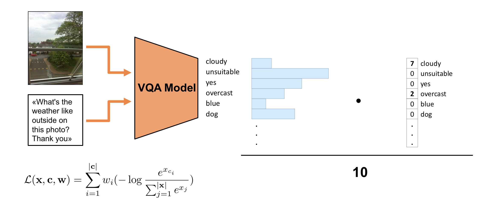

# VizWiz Challenge: Visual Question Answering Implementation in PyTorch

PyTorch VQA implementation that achieved top performances in the (ECCV18) [VizWiz Grand Challenge: Answering Visual Questions from Blind People][0].
The code can be easily adapted for training on VQA 1.0/2.0 or any other dataset.

The implemented architecture is a variant of the VQA model described in [Kazemi et al. (2017). Show, Ask, Attend, and Answer: A Strong Baseline For Visual Question Answering][1].
Visual feature are extracted using a pretrained (on ImageNet) ResNet-152. Input Questions are tokenized, embedded and encoded with an LSTM.
Image features and encoded questions are combined and used to compute multiple attention maps over image features. The attended image features 
and the encoded questions are concatenated and finally fed to a 2-layer classifier that outputs probabilities over the answers (classes). 

More information about the attention module can be found in [Yang et al. (2015). Stacked Attention Networks for Image Question Answering][2].


In order to consider all 10 answers given by the annotators we exploit a [Soft Cross-Entropy loss][3] : 
a weighted average of the negative log-probabilities of each unique ground-truth answer.
This loss function better aligns to the [VQA evaluation metric][4] used to evaluate the challenge submissions.




#### Experimental Results 

| method       | accuracy |
|--------------|----------|
| [VizWiz Paper][0] | 0.475    |
| **Ours**         | **0.516**    |


## Training and Evaluation
- Install requirements:
```
conda create --name viz_env python=3.6
source activate viz_env
pip install -r requirements.txt
```

- Download and extract the [VizWiz dataset][0]

```
wget https://ivc.ischool.utexas.edu/VizWiz/data/VizWiz_data_ver1.tar.gz
tar -xzf VizWiz_data_ver1.tar.gz
```
After unpacking the dataset, the Image folder will contain files with prefix `._VizWiz`.
Those files should be removed before extracting the image features:
```
rm ._*
```

- Set the paths to the downloaded data in the yaml configuration file `config/default.yaml`.

- Extract features from input images (~26GB) 
The script will extract two types of features from the images:
   - **No Attention**: 2048 feature vectors consisting of the activations of the penultimate layer of pre-trained ResNet-152.
   - **Attention**: 2048x14x14 feature tensors consisting of the activations of the last pooling layer of the ResNet-152.

   Our model will use only the "Attention" features. However it is possible to extend the implementation designing new models that do not use attention mechanisms.

```
python ./preprocessing/image_features_extraction.py
```

- Construct dictionaries that will be used during training to encode words and answers:

```
python ./preprocessing/create_vocabs.py
```

- Start training:
```
python train.py
```

During training, the models with the highest validation accuracy and with the lowest validation loss are saved. 
The path of the log directory is specified in the yaml configuration file `config/default.yaml`.

- Construct prediction file for the test split:
```
python predict.py
```


## Acknowledgment


- https://github.com/liqing-ustc/VizWiz_LSTM_CNN_Attention/
- https://github.com/Cadene/vqa.pytorch
- https://github.com/GT-Vision-Lab/VQA_LSTM_CNN
- https://github.com/Cyanogenoid/pytorch-vqa


[0]: http://vizwiz.org/data/
[1]: https://arxiv.org/abs/1704.03162
[2]: https://arxiv.org/pdf/1511.02274
[3]: https://arxiv.org/abs/1708.00584
[4]: https://arxiv.org/pdf/1505.00468v6.pdf

